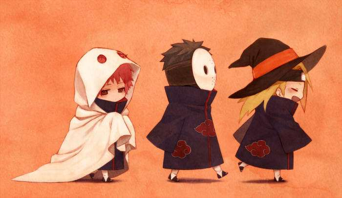

## 轮播DEMO

### 编写一个轮播的思路

1.在页面上写一个div,该div用于显示所需轮播的所有图片，
先让所有图片堆叠在一起（什么叫堆叠？就是一张图片叠在另一张图片的上面）。

2.为堆叠在一起的图片添加样式，左边的图片使用transform: translate(-150px, 0) scale(0.8);
让它相对于原本的位置偏移150PX，并以中心点为中心，缩小到原图片0.8倍的大小，右边的图片同理。

3.使用z-index属性，设置图片堆叠时，哪张图片将会被置顶。数值最大的图片将会在顶部，依次排列。

4.为左右按钮添加JS点击事件。

5.为轮播的所有图片添加样式transition: all 0.3s ease，如果不添加该语句，
将会缺少图片切换时的动效。

### 1.添加一个展示所有图片的div
```$javascript
<style>
    .image_box{
        width: 350px;
        height: 200px;
        /*水平、垂直居中*/
        position: absolute;
        top: 50%;
        left: 50%;
        transform: translate(-50%, -50%);
    }
</style>

<div class="image_box">
    
    
    
</div>
```

### 2.为图片添加样式

```$xslt
<style>
    .image_box img{
        /*使所有的图片堆叠在一起*/
        position: absolute;
        top: 0;
        left: 0;
        display: inline-block;
        height: 100%;
        width: 100%;
        /*图片变大变小时的动效*/
        transition: all 0.3s ease;
    }
    .left{
        transform: translate(-150px, 0) scale(0.8);
        opacity: 0.8;
        z-index: 0;
    }
    .center{
        transform: translate(0, 0) scale(1);
        opacity:1;
        z-index: 4;
    }
    .right{
        transform: translate(150px, 0) scale(0.8);
        opacity: 0.8;
        z-index: 0;
    }
</style>
```

### 3.为按钮添加JS点击事件

```$xslt
<script>
    let css_list = ['left', 'center', 'right'];
    $(".left-button").click(function () {
        // 向集合的最后一位添加新元素
        css_list.push(css_list[0]);
        // 移除集合的首元素
        css_list.shift();
        $('.image_box img').each(function (index, element) {
            $(element).removeClass().addClass(css_list[index]);
        })
    });
    $(".right-button").click(function () {
        // 向集合开头添加元素
        css_list.unshift(css_list[2]);
        // 移除集合最后一个元素
        css_list.pop();
        $('.image_box img').each(function (index, element) {
            $(element).removeClass().addClass(css_list[index]);
        })
    });
</script>
```